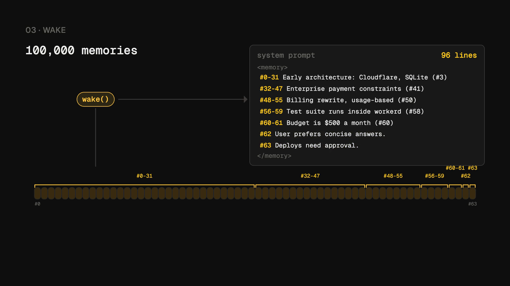

# pi-durable-memory

Long-term memory for [Pi Durable](https://github.com/earendil-works/pi/tree/main/packages/durable) agents on Cloudflare. One Durable Object per memory scope. Inside it, an append-only log of one-line memories, a binary tree of summaries above it, and a stored view of the whole history that fits a byte budget, coarse for old memories and verbatim for recent ones. The agent's system prompt carries that view at the start of each run. The exact memories are always one `zoom` or `recall` away. The memory model is [OptMem](https://github.com/VictorTaelin/OptMem) by Victor Taelin, and the view and the summarizer follow his [UniiChat](https://gist.github.com/VictorTaelin/91837951a5ce5b38f341ec1ba1df6449) spec, reimplemented for this runtime. See [Credits](#credits).

Pi Durable's compaction manages the context of one conversation. This package manages knowledge that outlives conversations, sessions, and harnesses.

## Two minutes on how it works

[](docs/explainer.mp4)

[Watch the video](docs/explainer.mp4) (2:20, with narration). The log, the binary tree and its free merges, the view that only appends and merges so the prompt cache keeps it, zoom back to the exact memory, and the two things that go wrong at scale.

## Setup

Three pieces: the memory object, the extension in the agent, and the wrangler binding.

```ts
// memory.ts
import { defineMemoryObject } from "pi-durable-memory/cloudflare";

export const MemoryObject = defineMemoryObject<Env>({
	summarizer: (env) => ({
		complete: (request) => completeWithYourModel(env, request),
	}),
});
```

`request.system` is a constant system prompt and `request.turns` is a short conversation. Send the turns as messages in order. A user turn's `blocks` are text blocks, and an assistant turn's `text` is the model's earlier reply. Return the model's text. The first block of the first turn is the context, which consecutive requests share, so put a cache breakpoint after it when your provider has one.

```ts
// agent.ts, inside the Pi Durable harness setup
import { createPiMemoryExtension } from "pi-durable-memory";
import { createMemoryClient } from "pi-durable-memory/cloudflare";

registry.install(
	createPiMemoryExtension({
		memory: createMemoryClient(env.MEMORY),
		scopes: () => [`agent:${agentName}`, "project:unprice"],
	}),
);
```

```jsonc
// wrangler.jsonc
{
	"durable_objects": { "bindings": [{ "name": "MEMORY", "class_name": "MemoryObject" }] },
	"migrations": [{ "tag": "v1", "new_sqlite_classes": ["MemoryObject"] }]
}
```

Install with `pnpm add pi-durable-memory`. Peer dependencies: `@earendil-works/pi-durable`, `@earendil-works/pi-ai`, `@cloudflare/workers-types`.

## What the agent gets

At the start of each run, the system prompt carries a `<memory>` section. It starts with the admission policy the model follows, then each scope's view:

```
<memory>
Long-term memory, kept across sessions, oldest first per scope. Remember with
memory_note: durable preferences, decisions, facts likely useful in future
sessions, outcomes, lessons. Do not remember greetings, transient execution
details, routine tool output, or anything already remembered. One line per
memory, under 280 bytes. A #a-b line summarizes memories a through b: use
memory_recall for exact old facts and memory_zoom on a #a-b line to open it.
Zoom whenever a line only mentions something you need, before you act, guess
or ask. Notes you save appear here from the next message on.

[agent:support]
#0-511 Early architecture: Workers and Durable Object SQLite, chosen for per-scope isolation; billing is usage-based on Stripe
#512-767 Acme cannot use Stripe and pays by invoice; deploys need approval, never on Fridays
#768-775 User prefers concise answers and tables; staging lives in eu-west
#776 Deploys need approval.

[project:unprice]
#0-15 Budget is $500 a month for models; tests run inside workerd
#16 Seb owns billing.
</memory>
```

The extension renders this text once per run and reuses it for every tool step of that run, so a note saved mid-run shows from the next message on. Between runs, each scope's view only gains memories at its end, until it passes `viewBytes` and one batch merges old lines down to half of that. So most of the section stays byte-identical from one run to the next, and the provider's prompt cache keeps it. Three tools:

| Tool | What it does |
|---|---|
| `memory_note(content, scope?)` | Stores one line. Replay-safe: the tool task id is the idempotency key, so a crash and retry never duplicates. |
| `memory_recall(query, scope?, limit?)` | Full-text search over the raw memories, newest first. |
| `memory_zoom(startId, endId, scope?)` | Opens a `#a-b` line into its two halves, down to the raw memories. |

Nothing else is the model's job. Compaction runs from the object's alarm after every write.

## Scopes

A scope is any string: `agent:support`, `user:seb`, `project:unprice`, `company:acme`. Each is one Durable Object, named by the string. A conversation's `scopes` function lists what it reads and may write to, first entry being the default for `memory_note`. A shared scope such as `project:unprice` is one object that several agents call. Each scope's view has its own byte budget, `viewBytes`.

Name an agent's scope by something the host knows, such as the agent's name. The `scopes` function also receives the Pi `conversationId`, but every harness numbers its root conversation 1, so `agent:${conversationId}` would put every agent in the same scope.

## Deciding what to remember

By default the model decides, guided by the policy paragraph above. The extension's `admission` hook can take that decision away from it:

```ts
import { createRetrievalAdmission } from "pi-durable-memory";

const admission = createRetrievalAdmission({
	judge: {
		async judge({ candidate, neighbors }) {
			// neighbors: the stored memories closest to the candidate, by words
			// return { verdict: "new" } | { verdict: "duplicate", of } | { verdict: "supersedes", id } | { verdict: "reject", reason }
		},
	},
});
```

Before every `memory_note`, the hook recalls the five nearest existing memories and asks the judge what the candidate is. A duplicate is skipped with `Not saved: duplicate of #12`. A supersede stores the new memory and retires the old one: it stays in the log but leaves `wake`, `recall`, and the summarizer's input. A reject is skipped with the reason. A judge naming an id it was never shown is treated as new.

### With Jev

[Jev](https://docs.typesafe.ai/) is TypeSafe AI's System One model: typed questions, calibrated probabilities, no generation. It fits the judge role exactly because admission is a decision, not a text.

```ts
import { TypeSafeClient } from "@typesafe-ai/sdk";
import { createJevAdmission } from "pi-durable-memory/jev";

const admission = createJevAdmission({
	client: new TypeSafeClient({ apiKey: env.TYPESAFE_API_KEY }),
	minDurable: 0.5, // below this probability the note is rejected as not durable
	minRelation: 0.6, // below this confidence a duplicate or supersede is treated as new
});

registry.install(createPiMemoryExtension({ memory, scopes, admission }));
```

One `systemOne` call per note asks three things: is the candidate durable, how it relates to the nearest memories (new, duplicate, supersedes), and which one it duplicates or replaces. A rejection returns `Not saved: not durable (p=0.21)` to the model. `@typesafe-ai/sdk` is an optional peer dependency; pass `apiKey` explicitly on Workers.

Jev does not write summaries. Summarization needs a generative model behind `summarizer`.

## How it works inside the object

```
note #7      #0 #1 #2 #3 #4 #5 #6 #7      ← the log, never edited
              └─┘  └─┘  └─┘  └─┘
             #0-1 #2-3 #4-5 #6-7          ← level 1, two memories each
               └────┘    └────┘
               #0-3      #4-7             ← level 2, two level-1 nodes each
                  └────────┘
                    #0-7                  ← level 3
```

- **Log.** `memories(scope, id, created_at, content, source_id, supersedes)`. Ids are positions. Rows are never updated or deleted.
- **Tree.** `memory_nodes(scope, level, start_id, end_id, summary)`. The tree is strictly binary. A level-1 node merges two memories, and a node at level l merges its two children at level l-1. The store accepts a node only when it is the next one at its level and both children exist, so each level is a dense prefix. Nodes are never deleted.
- **Free merges.** When the two children joined by ` / ` fit in `summaryBytes` (512), that text is the node and no model runs. A superseded memory counts as empty, so a block whose memories were all superseded becomes an empty node, and the view leaves it out. Short notes climb a few levels verbatim before the first model call.
- **View.** `memory_view(scope, start_id, level)` holds the lines `wake()` returns, aligned blocks that tile the log, oldest first. It changes in two ways only. A new memory is appended at the end. When the text passes the high mark, `viewBytes` (16,384), one batch merges pairs of sibling lines into their built parents, most due pair first. The batch stops once the text is at most the low mark, half of `viewBytes`, or once no pair has a built parent. With T memories in the log, a pair of level-l lines whose last memory is m is due by (T - m) / 2^l: how long ago the pair ended, measured in its own line size. Old lines merge first and each level keeps about as many lines. With both marks set to the length of Victor Taelin's rollback `push` list, in lines, each batch is one merge, and the view makes exactly the merges `push` makes, at every step. Larger batches keep that order and change only when the merges happen. Between batches each wake's view is a prefix of the next, and a batch rewrites the view once instead of a little at every note. So the text moves between half of `viewBytes` and `viewBytes`. Nothing is split. A parent enters the view only once built, so there is never a placeholder. Until compaction builds the parents, the view shows every memory, over `viewBytes`. A scope with memories but no stored view, such as one written before this version, is folded from memory 0 in one pass on its next wake, note, or compaction.
- **Compaction.** Every `note` sets an alarm. A round takes up to 8 blocks whose children are built, by level and then position. It stores the free merges, runs the summarizer for the rest concurrently, stores the results in order, and folds the view. When the view is still over `viewBytes` because parents were missing, that fold runs the next batch. The alarm runs rounds until it has stored `mergesPerAlarm` (32) nodes and reschedules while nodes are missing. A summarizer failure comes back in `compact()`'s `failed` list instead of a throw. The alarm logs each failing block once and tries again 10 s later. It never throws to the platform, whose alarm backoff gives up after six retries.
- **Summaries.** The summarizer gets a request with a constant system prompt and one user turn of two blocks. The first is the view up to the end of the block as bare lines inside `<memory>`. The second asks for one line of at most `summaryBytes`, shows a ruler of that many dashes, and puts the two lines to merge inside `<input>`. Models cannot count bytes, so the ruler shows the length. The UniiChat spec reports that a real sample line in its place gets its content copied into the summary. No id appears anywhere, because models copy ids into their output. When the reply is over `summaryBytes`, the same conversation continues. The model gets the line's size and the limit, and sees its line cut where the limit falls. The loop stops at the first line that fits or after five tries, and keeps the shortest line, never truncated.
- **Your own summarizer loop.** Without a `summarizer`, no alarm runs. `nextMerge()` stores the free merges and returns the next block with the request the core would send. `commitMerge(range, summary)` stores your model's answer and rejects an empty one or one over `summaryBytes`.
- **Search.** FTS5 inside Durable Object SQLite, with `LIKE` as a fallback.

`defineMemoryObject` options: `summarizer(env)`, `limits` (`maxEntryBytes` 280, `summaryBytes` 512, `viewBytes` 16,384 as the view's high mark, with half of it as the low mark), `mergesPerAlarm` (32).

`scripts/view-stability.mjs` replays 2,000 notes, compacting after each, and measures how much of each wake the next one keeps byte for byte. With `viewBytes` at 24,000, consecutive wakes share 99.1% of the previous view on average and all of it at the median, and 10 of 1,000 wakes keep less than half. At 16,384 they share 98.8% on average, and 13 keep less than half. Before batches, when the view merged one pair per note, consecutive wakes shared 90.8% at 24,000 and 91.2% at 16,384, with 86 and 67 wakes below half. The cover this package used before that shared 61% on average and 70.5% at the median.

## Invariants the tests hold

- Raw memories are never modified by compaction or supersede.
- One `sourceId` never creates two memories.
- Every node covers an aligned block and is built from exactly its two children.
- A node is stored only as the next one at its level with both children present, whatever order `commitMerge()` is called in.
- Between two wakes the view only gains memories at its end, or one batch merges lines into their parents until it is at most half of `viewBytes`. It never splits a line or shows a placeholder, and it fits `viewBytes` once the parents it needs are built.
- A log of 100,000 memories with no stored view folds in under 5 seconds.
- A summarizer request contains no `#` id. A reply over the limit is asked again with the cut shown, and the shortest of five tries is kept.
- At most 8 summarizer conversations run at once, and one failing block does not stop the others.
- `zoom()` opens only built summaries and reaches raw memories.
- Two scopes never leak into each other.
- A replayed Pi tool call does not duplicate a memory.
- The memory section stays the same across the tool steps of one run and refreshes on the next.
- Inside workerd, the alarm reschedules until nothing is pending, and 10 s after a summarizer failure.

## Development

```sh
pnpm install
pnpm check   # typecheck, Node tests (core and extension on node:sqlite), workers-runtime tests (the object, inside workerd)
pnpm build && node scripts/view-stability.mjs . 2000 24000   # how much of each wake the next one keeps
```

## Try it over MCP

`examples/mcp-demo` is one Worker that gives Claude Code or Codex a memory over MCP. `memory_note`, `memory_recall`, and `memory_zoom` work as in the Pi extension, and `memory_wake` reads the view. The memory object has no summarizer, so the agent writes each summary line itself through `memory_pending` and `memory_commit`. A web page shows the view and opens each `#a-b` line into its two halves. There is no login. Each memory lives at a URL with an unguessable id, and anyone who has that URL can read and write the memory.

To run it locally, start the dev server. The script builds this package first.

```sh
pnpm install
pnpm --filter mcp-demo dev   # http://localhost:8787
```

Open http://localhost:8787 and click **Create a memory**. The page shows the memory's URL and the command that connects your agent to it:

```sh
claude mcp add --transport http memory http://localhost:8787/m/<id>
codex mcp add memory --url http://localhost:8787/m/<id>
```

With the dev server running, `pnpm --filter mcp-demo smoke` calls every tool through the MCP client and checks the replies.

## Credits

The memory model is [OptMem](https://github.com/VictorTaelin/OptMem) by [Victor Taelin](https://github.com/VictorTaelin): an append-only log of one-line memories, a binary tree of summaries over aligned power-of-two blocks, and zoom and recall back to the raw entries. The view fold, the summarizer conversation, and the structure of the summarizer prompt follow his spec, first published as OptChat and now called [UniiChat](https://gist.github.com/VictorTaelin/91837951a5ce5b38f341ec1ba1df6449): a strictly binary tree, a stored view that only appends and merges its most due pairs in batches, a summarizer that sees that view as context, and a ruler with cut-at-limit retries to keep summaries near their size. The spec puts ids in the summarizer's request so that compactions share the agent's prompt cache. This summarizer has no such cache to share, so its requests carry no ids. UniiChat logs every chat message. This package keeps OptMem's curated notes and builds UniiChat's structure above them. His tools are written for a shell agent. This package is a TypeScript implementation of the same design for Pi Durable agents on Cloudflare Durable Objects, with an injected summarizer, scopes, idempotent notes, and an admission hook. No code is shared.

If you build on this, credit OptMem and UniiChat too.
